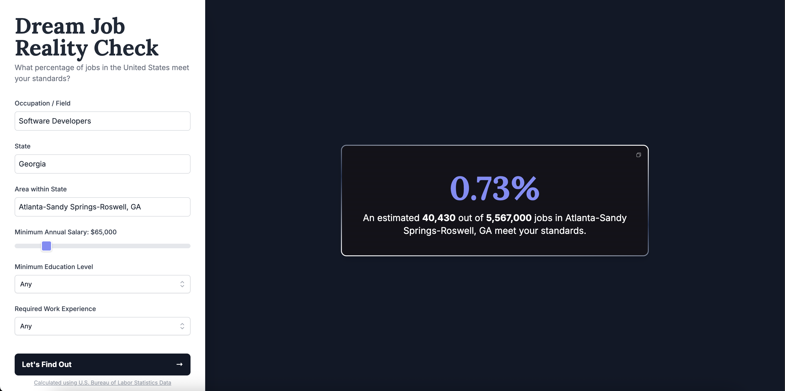

# Dream Job Reality Check

Interactive tool that answers: *"What percentage of jobs meet my standards?"*  
Users pick an occupation, geography (state + area), minimum salary, education, and experience. The app returns two perspectives:
1. Regional – Jobs meeting criteria in the chosen area.
2. National – Jobs meeting the same criteria across the entire U.S.


- Live App: **[https://www.dreamjobrealitycheck.com/](https://www.dreamjobrealitycheck.com/)** 
- Backend API Base: **https://dream-job-reality-check-api-1.fly.dev/**
---

## Table of Contents
1. [Architecture](#architecture)
2. [Features](#features)
3. [User Inputs](#user-inputs)
4. [Data Model](#data-model)
5. [Data Processing Pipeline](#data-processing-pipeline)
6. [Backend API](#backend-api)
7. [Frontend Components](#frontend-components)
8. [Environment Variables](#environment-variables)
9. [Local Development](#local-development)
10. [Deployment](#deployment)
11. [Request / Response Example](#request--response-example)
12. [Business Logic Notes](#business-logic-notes)
13. [Future Improvements](#future-improvements)
14. [Acknowledgements](#acknowledgements)

---

## Architecture
| Layer | Tech | Responsibility |
|-------|------|----------------|
| Frontend | React 19 + Vite + Tailwind | Collect filters, display results (regional / national toggle) |
| Backend | Go 1.21 | REST API, query construction, aggregation, percentage computation, rate limiting |
| Database | Supabase (PostgreSQL) | Managed Postgres: single fact table `career_data` with employment & wage distribution data |
| Hosting | Fly.io (API), Vercel/Static Host (UI), Supabase (DB) | Stateless API container + static frontend + managed DB |

Flow: UI builds query params → `GET /api/calculate` → backend queries Supabase Postgres & aggregates employment & salaries → adds national denominator → JSON returned → UI displays counts & percentages.

---

## Features
Backend:
- Parameterized dynamic filtering (occupation, location, salary, education, experience)
- Inclusive salary distribution filter (any percentile meeting threshold qualifies)
- Regional + national perspectives in one response
- Lightweight IP rate limiter (100 req/min)
- CORS with configurable origins
Frontend:
- Searchable dropdowns for occupations, states, and areas
- Slider for salary (30k–250k)
- Ladder semantics for education/experience (handled server-side)
- Animated result card with national/regional toggle
- Graceful loading & error handling states

---

## User Inputs
| Field | Source / Component | Backend Param | Notes |
|-------|--------------------|---------------|-------|
| Occupation | `Filters` (SearchableDropdown) | `occupation` | Matches `occ_title` (case-insensitive) |
| State | `Filters` | (used to fetch areas) | Distinct state-level `area_title` |
| Area within State | `Filters` | `location` | Full `area_title` |
| Minimum Salary | `Filters` (range slider) | `minSalary` | Inclusive across percentile wage columns |
| Education | `Filters` (CustomSelect) | `education` | Ladder semantics; omitted if "Any" |
| Experience | `Filters` (CustomSelect) | `experience` | Ladder semantics; omitted if "Any" |

---

## Data Model
Single table `career_data` (one row per occupation–area pair):

| Column | Type | Description |
|--------|------|-------------|
| id | SERIAL | Surrogate primary key |
| area_title | VARCHAR(255) | Geographic area / state / metro / non-metro |
| occ_code | VARCHAR(15) | Occupation code (e.g. `15-1252`) |
| occ_title | VARCHAR(255) | Occupation title |
| education | VARCHAR(255) | Education requirement label |
| experience | VARCHAR(255) | Prior work experience label |
| tot_emp | INTEGER | Employment count for occupation in area |
| a_median | INTEGER | Median annual wage |
| a_pct10 | INTEGER | 10th percentile wage |
| a_pct25 | INTEGER | 25th percentile wage |
| a_pct75 | INTEGER | 75th percentile wage |
| a_pct90 | INTEGER | 90th percentile wage |

Uniqueness: `(area_title, occ_code)`.

National denominator: record with largest `tot_emp` where `occ_code = '00-0000'`.

---

## Data Processing Pipeline
The `career_data` table is produced by preprocessing raw Bureau of Labor Statistics datasets. The scripts and intermediate artifacts live in `data-processing/`.

**Source Inputs**
| File | Origin | Purpose |
|------|--------|---------|
| `all_data_M_2023.xlsx` | OEWS (Occupational Employment & Wage Statistics) 2023 | Employment counts & wage distribution percentiles by occupation & area |
| `education.xlsx` | BLS Employment Projections – Table 5.4 | Typical education needed for entry & work experience requirements |

**High-Level Steps**
1. Load OEWS workbook; treat `*`, `**`, `#` as missing.
2. Filter to `I_GROUP == 'cross-industry'` (cross‑industry rollups only).
3. Keep detailed occupations (`O_GROUP == 'detailed'`) OR the national aggregate row (`OCC_CODE == '00-0000'`).
4. Deduplicate on `(AREA_TITLE, OCC_CODE)` (first record wins).
5. Select & type‑clean employment + wage percentile columns; drop rows missing both employment and median salary.
6. Load Employment Projections sheet `Table 5.4`; extract education & experience columns.
7. Merge on `OCC_CODE` to enrich OEWS rows with education / experience ladders.
8. Reorder columns → export `combined_career_data.csv`.
9. Import CSV into Supabase Postgres as `career_data` (enforce UNIQUE `(area_title, occ_code)`).

**Generated Artifacts**
| File | Description |
|------|-------------|
| `cleaned_oes_data.csv` | Filtered & de‑duplicated OEWS subset (employment + wages) |
| `combined_career_data.csv` | Final merged dataset loaded into production DB |

**Scripts**
| Script | Role |
|--------|------|
| `processData.py` | Produce `cleaned_oes_data.csv` from raw OEWS workbook |
| `tableCombinationGenerator.py` | Merge cleaned OEWS with EP education/experience into final CSV |
| `diagnose_duplicates.py` | Inspect problematic duplicate occupation/area key pairs |

**Important Conventions**
- National totals may have multiple variants; downstream code picks the largest `tot_emp` for `occ_code='00-0000'` as the canonical denominator.
- Education & experience labels are preserved verbatim; ladder logic is applied in the backend at query time.
- Salary threshold logic leverages percentile columns (`a_pct10`...`a_pct90`) enabling inclusive filtering.

**Reproduce Locally**
```
cd data-processing
python processData.py
python tableCombinationGenerator.py
```
Load `combined_career_data.csv` into Postgres once validated (row counts & spot checks).

---

## Backend API
Base path: `/api`

| Method | Endpoint | Description |
|--------|----------|-------------|
| GET | `/calculate` | Returns match metrics & salary distribution |
| GET | `/occupations` | Distinct occupation titles |
| GET | `/locations` | Distinct non-national areas |
| GET | `/states` | State-level area titles |
| GET | `/areas-by-state?state=STATE` | Areas associated with a state |
| GET | `/health` | Health check |

Response (core fields):
```json
{
  "percentage": 0.0123,
  "percentageRegion": 0.45,
  "matchingJobs": 12345,
  "totalJobs": 151853870,
  "totalJobsRegion": 611400,
  "location": "Alaska",
  "minSalaryMet": true,
  "salaryInfo": { "medianSalary": 118000, "pct10Salary": 75000, "pct25Salary": 90000, "pct75Salary": 145000, "pct90Salary": 178000 }
}
```

Rate Limiting: 429 JSON `{ "error": "rate limit exceeded" }` after limit breached.

---

## Frontend Components
| Component | Role |
|-----------|------|
| `App` | Layout + state orchestration |
| `Filters` | Form state, validation, API calls for lists |
| `Results` | Displays placeholder/loading/error/result + national/regional toggle |
| `AnimatedGradientBorder` | Animated border wrapper for results |
| `SearchableDropdown` | Large list filtering (occupations, states, areas) |
| `CustomSelect` | Styled simple select (education, experience) |
| `DataInfoModal` | Dataset attribution popup |
| `api/client.js` | Fetch helper (query builder, error handling) |

---

## Environment Variables
Backend:
```
DB_HOST=...
DB_PORT=5432
DB_USER=...
DB_PASSWORD=...
DB_NAME=...
DB_SSLMODE=disable   # or require in production
SERVER_PORT=8080
CORS_ORIGIN=https://your-frontend.example
```
Frontend (`.env` / build time):
```
VITE_API_BASE_URL=https://your-api-url.example
```

---

## Local Development
Backend:
```
cd backend
go mod tidy
go run .
```
Frontend:
```
cd frontend
npm install
npm run dev
```
Visit: http://localhost:5173 (default Vite) — ensure backend CORS allows that origin.

Optional health check:
```
curl http://localhost:8080/api/health
```

---

## Deployment
### Backend (Fly.io example)
1. Build & launch app (if not already):
	```
	cd backend
	fly launch --no-deploy
	```
2. Set secrets:
	```
	fly secrets set DB_HOST=... DB_PORT=5432 DB_USER=... DB_PASSWORD=... DB_NAME=... DB_SSLMODE=require CORS_ORIGIN=https://your-frontend.example
	```
3. Deploy:
	```
	fly deploy
	```
4. Verify health:
	```
	curl https://your-api-url.example/api/health
	```

### Frontend (Static Host / Vercel / Netlify)
1. Provide build-time environment var `VITE_API_BASE_URL` pointing to deployed API.
2. Build:
	```
	npm run build
	```
3. Deploy contents of `frontend/dist/`.
4. Confirm network calls succeed (CORS + HTTPS alignment).

---

## Request / Response Example
```
GET /api/calculate?location=Detroit-Warren-Dearborn%2C+MI&occupation=Software+Developers&minSalary=70000&education=Bachelor's%20degree&experience=None
```
Abbreviated response (see full schema above):
```json
{
  "percentage": 0.0158902766192261,
  "percentageRegion": 0.638723083235174,
  "matchingJobs": 24130,
  "totalJobs": 151853870,
  "totalJobsRegion": 3777850,
  "location": "Detroit-Warren-Dearborn, MI",
  "minSalaryMet": true
}
```

---

## Business Logic Notes
- Salary threshold is inclusive if ANY wage percentile meets/exceeds `minSalary`.
- Education & experience selection trigger ladder expansion server-side (selecting a minimum includes higher tiers, except non-ladder labels which map explicitly).
- National denominator chosen by max `tot_emp` for `occ_code='00-0000'` to avoid duplicate national rows across preprocessing variants.
- Percentages computed as floats, frontend prettifies display (zero compression).

---

## Future Improvements
- Distributed rate limiting (Redis) & caching for lookup endpoints
- Visualization of salary distribution (sparkline or bars)
- Local persistence of last search (localStorage)
- Metrics & structured logging (OpenTelemetry / Prometheus)
- Accessibility audit & keyboard enhancements
- Internationalization / currency formatting

---

## Acknowledgements
Data derived from U.S. Bureau of Labor Statistics sources (processed & normalized).  
Built with Go, PostgreSQL, React, Vite, Tailwind, Fly.io.

---

> This README summarizes both backend and frontend implementations and deployment approach for rapid understanding and onboarding.

